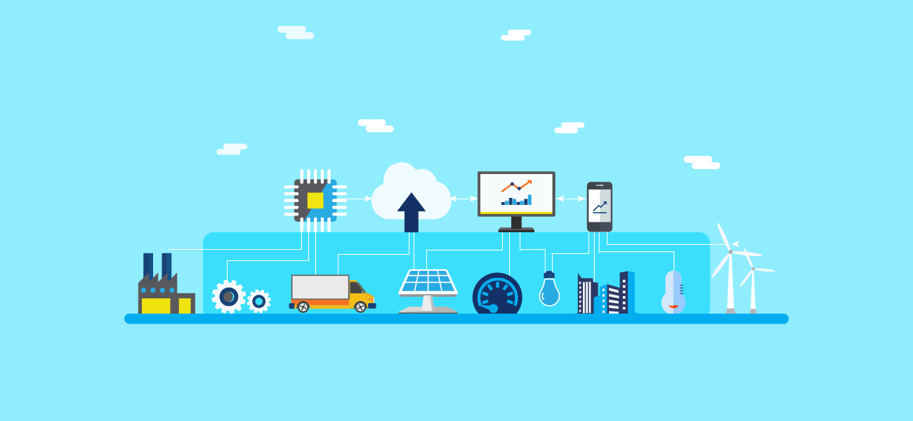

# Edge Computing: Vision and Challenges

## Overview

Edge computing represents a transformative shift in how we process data in an increasingly connected world. With the rise of the Internet of Things (IoT) and the limitations of traditional cloud computing, this paradigm pushes computation closer to where data is generated—at the edge of the network. This approach promises faster response times, reduced bandwidth usage, enhanced privacy, and more efficient resource utilization. This document explores the vision of edge computing, its practical applications, and the challenges and opportunities it presents.

## Why Edge Computing?

The need for edge computing emerges from two key forces: the limitations of cloud-centric systems and the explosive growth of IoT. Cloud computing, while powerful, struggles with the sheer volume of data produced at the network's edge, where slow network speeds and privacy concerns create bottlenecks. Meanwhile, IoT devices—ranging from sensors to smart appliances—are generating vast amounts of data that demand real-time processing and local decision-making. Edge computing bridges this gap by shifting the role of edge devices from mere data consumers to both producers and processors, enabling smarter, faster, and more secure systems.

## What is Edge Computing?

At its core, edge computing is about performing computation as close as possible to the data source. It leverages devices and resources—like smartphones, home gateways, or small data centers—positioned between the data origin and the cloud. Unlike traditional cloud models, where data travels long distances for processing, edge computing handles data locally, offloading tasks from the cloud and reducing strain on networks. It’s a complementary approach to fog computing, with a sharper focus on the "things" side of the equation, empowering devices to act autonomously while still connecting to broader systems.

## Practical Applications

Edge computing shines in scenarios where speed, scale, and privacy are paramount. Here are some compelling use cases:

### Cloud Offloading
By moving tasks like shopping cart updates or navigation searches to edge nodes, latency drops significantly, improving user experiences in interactive services.
### Video Analytics
Imagine finding a lost child using city-wide cameras. Instead of uploading all footage to the cloud, edge devices analyze local data and report only what’s relevant—faster and with less privacy risk.
### Smart Homes
In a connected home, an edge gateway can manage sensors and devices locally, processing data in real-time while keeping personal information secure within the household.
### Smart Cities
For a city, edge computing handles massive data from traffic, utilities, and safety systems, delivering low-latency decisions and location-aware insights without overwhelming central servers.
### Collaborative Edge
Edge nodes can connect stakeholders—like hospitals and pharmacies in healthcare—allowing secure data sharing and collaboration without compromising privacy.

## Vision Forward

Edge computing is poised to reshape how we interact with technology, bringing computation closer to our lives. By processing data where it’s created, it offers a path to smarter homes, cities, and systems, all while addressing the growing demands of a connected world. The journey ahead involves tackling these challenges collaboratively, unlocking a future where the edge is as powerful as the cloud.

---

## Visual Insight

Here’s a glimpse of edge computing in action:

---
